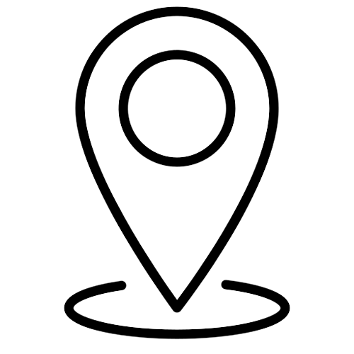

<!-- PROJECT SHIELDS -->
[![Stargazers][stars-shield]][stars-url]
[![Issues][issues-shield]][issues-url]
[![LinkedIn][linkedin-shield]][linkedin-url]

<!-- PROJECT LOGO -->
<br />
<p align="center">
  <a href="https://github.com/aindrajaya/react-map">
    
  </a>

  <h3 align="center">React GIS Application</h3>

  <p align="center">
    React GIS App build using Leaflet
    <br />
    <a href="https://github.com/aindrajaya/react-map"><strong>Explore the docs »</strong></a>
    <br />
    <br />
    <a href="https://github.com/aindrajaya/react-map">View Demo</a>
    ·
    <a href="https://github.com/aindrajaya/react-map/issues">Report Bug</a>
    ·
    <a href="https://github.com/aindrajaya/react-map/issues">Request Feature</a>
  </p>
</p>

<!-- TABLE OF CONTENTS -->
<details open="open">
  <summary>Table of Contents</summary>
  <ol>
    <li>
      <a href="#about-the-react-gis-application">About The Project</a>
      <ul>
        <li><a href="#built-with">Built With</a></li>
      </ul>
    </li>
    <li>
      <a href="#getting-started">Getting Started</a>
      <ul>
        <li><a href="#installation">Installation</a></li>
      </ul>
    </li>
    <li><a href="#roadmap">Roadmap</a></li>
    <li><a href="#feature-and-data-analysis">Features and Data Analysis</a></li>
    <li><a href="#contact">Contact</a></li>
    <li><a href="#license">License</a></li>
    <li><a href="#acknowledgements">Acknowledgements</a></li>
  </ol>
</details>

<!-- ABOUT THE PROJECT -->
## About the React GIS Application
[![Product Name Screen Shot][product-screenshot]](https://react-map-seven.vercel.app/)

This project enhancing ReactJS GIS implementation using Leaflet. This project has a tool for visualizing and analyzing spatial data. It uses [GeoJSON](http://geojson.org/) files as input and allows users to view and manipulate the data in various ways.

### Built With
This projects is built with
* [Leaflet](https://leafletjs.com/) for mapping and visualization
* [React](https://reactjs.org/) is a JavaScript library for building user interfaces
* [Vite](https://vitejs.dev/) a javascript build tool
* [GeoJSON](https://geojson.org/) is a format for encoding a variety of geographic data structures.


<!-- GETTING STARTED -->
## Getting Started
This is an example of how you may give instructions on setting up your project locally.
To get a local copy up and running follow these simple example steps.

### Installation
To run the application, after you install [Node.js](https://nodejs.org/) you also need [yarn](https://yarnpkg.com/) installed on your system. This project is also using [vite](https://vitejs.dev/) as a build tool that aims to provide a faster develpoment experience. Once you have those dependencies installed, you can install the application by running the following command in the root directory of the project:
```bash
$ cd your-project
$ yarn
$ yarn dev
``` 

### Usage
To use the application, you will need to have a GeoJSON file that you want to visualize. Once you have the file, you can start the application by running the following command:
```bash
$ yarn dev
```
This will start the application and open a web browser window with the application interface. From there, you can use the various controls to view and manipulate the data in the GeoJSON file.


<!-- ROADMAP -->
## Roadmap

See the [open issues](https://github.com/aindrajaya/react-map/issues) for a list of proposed features (and known issues).

<!-- FEATURE -->
## Feature and Data Analysis
### Data 
Geospatial data taken from this [GeoJSON file](https://d2ad6b4ur7yvpq.cloudfront.net/naturalearth-3.3.0/ne_50m_populated_places_simple.geojson). At this phase I just converted to JavaScript object variable to make it simple to use, and for the next phase it will be `.json` file.
> *Note:* Geospatial data refers to data that is associated with a specific location on the earth's surface. This can include data about geographical features, such as rivers, mountains, and roads, as well as data about human-made structures, such as buildings, bridges, and pipelines.

### Features
* Show map Marker from the Geospatial Data above
* Custom marker
* Filter radius based on Marker (City)
* Custom circle radius (add tooltip for more information)
* Geo filter, filter by continents
* ~~Analyse geospatial data ()~~ (Under development)
* etc...


<!-- CONTACT -->
## Contact
Arista - [@Arista_Indra](https://twitter.com/Arista_Indra) - arista.indrajay@gmail.com

Project Link: [React GIS](https://github.com/aindrajaya/react-map)

<!-- LICENSE -->
## License
This application is licensed under the MIT License. See the [LICENSE](LICENSE) file for more details.

<!-- ACKNOWLEDGEMENTS -->
## Acknowledgements
* [React](https://reactjs.org/)
* [Leaflet](https://leafletjs.com/)
* [GeoJSON](https://geojson.org/)
* [Vite](https://vitejs.dev/)
* [GitHub Emoji Cheat Sheet](https://www.webpagefx.com/tools/emoji-cheat-sheet)
* [Img Shields](https://shields.io)
* [Choose an Open Source License](https://choosealicense.com)
* [GitHub Pages](https://pages.github.com)


<!-- MARKDOWN LINKS & IMAGES -->
<!-- https://www.markdownguide.org/basic-syntax/#reference-style-links -->
[stars-shield]: https://img.shields.io/github/stars/aindrajaya/react-map.svg?style=for-the-badge
[stars-url]: https://github.com/aindrajaya/react-map/stargazers
[issues-shield]: https://img.shields.io/github/issues/aindrajaya/react-map.svg?style=for-the-badge
[issues-url]: https://github.com/aindrajaya/react-map/issues
[linkedin-shield]: https://img.shields.io/badge/-LinkedIn-black.svg?style=for-the-badge&logo=linkedin&colorB=555
[linkedin-url]: https://www.linkedin.com/in/aindrajaya
[product-screenshot]: src/assets/screenshot.gif
